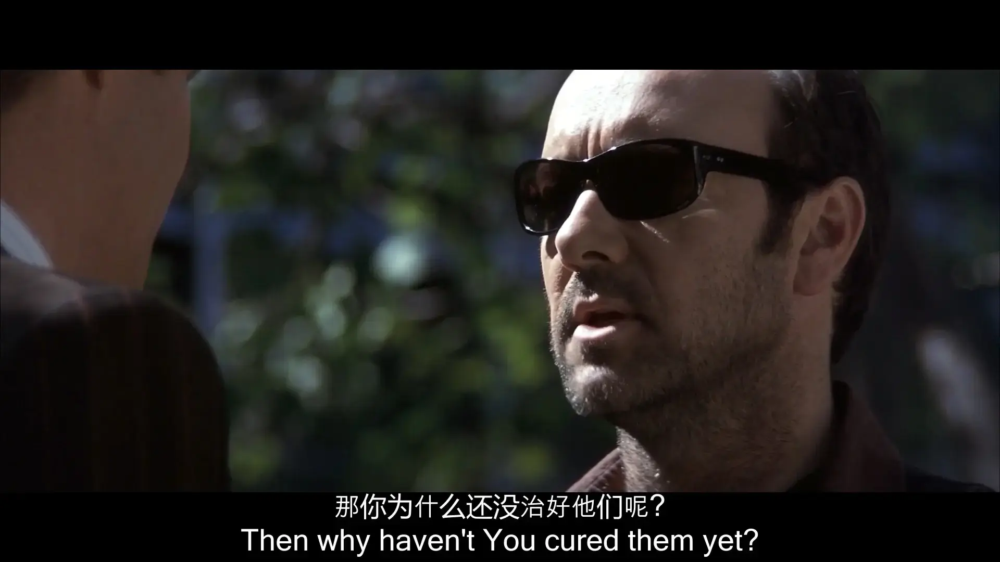

# 按

2025年4月20日首发于[B站](https://space.bilibili.com/103962007)

该节目是基于20年的笔记，去年直播讲过一次，现在以导图形式做成视频

注：保留署名、地址及作者联系方式、非商业目的可自由转载（包括文章及音视频）

# 时间轴

00：00 致命一击

00：28 导言

01：29 心理治疗的失败有必然性

02：00 模型虔信

02：47 经验模型的模糊性，导致对谈话治疗的依赖

04：03 常见错误

04：28 身心二分，轻忽身体

06：23 模型泛化能力弱

06：49 信息过载

09：11 反身性

10：21 影视作品导致的反身性

11：52 还是有点过于城市化了

12：42 自然环境

13：40 社会环境

14：15 职业病人的增加

16：11 总结，欢迎交流

# 多媒体

### Youtube

<iframe width="560" height="315" src="https://www.youtube.com/embed/-X-vDm2dlww?si=cM-W6-4Zoo6xxNAF" title="YouTube video player" frameborder="0" allow="accelerometer; autoplay; clipboard-write; encrypted-media; gyroscope; picture-in-picture; web-share" referrerpolicy="strict-origin-when-cross-origin" allowfullscreen></iframe>

### Bilibili

@[bilibili](BV1bzLAz7EYQ)

### 播客

<iframe width="100%" height="180" frameborder="no" scrolling="no" seamless="" src="https://share.transistor.fm/e/503162f8"></iframe>

# 逐字稿

由Grok整理，手动校对

---

这句非常耐人寻味的台词，来自凯文·史派西主演的电影《K星异客》——

自称来自外星的男主角波特，被送进精神病院后，对病人们进行指导。恼火的医生告诉他，治好这些病人是我的工作，不是你的。波特反问道 ：

**那、你、为、什、么、还、没、有、治、好、他、们、呢 ？**

## 引言

> 医生，你医治自己吧 —— 《路加福音 4:23》

## 导言

欢迎收听七叶电波，大家好，我是宸鸣。

我第一次看到相关话题是在10年左右，一位留学生说，自己看了多个国家、各种流派的心理医生都没有效果。随着心理疾患的增加，精神治疗与心理咨询的普及，类似的声音也越来越多。我在知乎上看到过对这个问题的讨论，主要是从这几个角度：

1. 起步晚 —— 国内相关行业起步晚，整体落后于发达国家
2. 大放水 —— 国内曾经大放水，发放了一百多万本二、三级心理咨询师证书，医师大概只有五千多人，导致从业者水平参差不齐
3. 门派之见 —— 还有一些评论是不同心理学流派的互相攻击
4. 药物滥用 —— 还有一个问题是药物滥用，这个通常是心理学领域的从业者对精神科医生的批评。关于这个问题的论辩在发达国家也广泛存在。

（ 注：在本节目中，精神病学也被纳入标题范畴 —— 因为中国大众通常并不区分精神科、心理治疗、心理咨询等词汇 ）

以上都是真实存在的问题，但大家有没有发现，这些观点都是基于鄙视链，很少有从心理学本身出发进行探讨的。前面两种是把国内放在鄙视链的底端，后两种是鄙视其他派别。但我想说句公道话（你们不要误会，我不是针对谁），**心理治疗的失败是普遍现象，它与心理模型的失效的必然性有关**。今天就从这个角度切入，用导图的形式跟大家分享我的思路。

这个视频更侧重于结构，比较具体的和细节性的东西，有时间会写一篇长文说明。这个节目会按导图的顺序讲，就画到哪儿讲到哪儿，就不按文章的逻辑来了。

## 模型如何失效

我们首先来看，为什么模型失效会导致治疗无效。首先，**模型不是事实**，而是对事实的抽象。就好比四驱车只是对真实赛车的模仿，手办只是对你幻想中的老婆的简化，商业模型是对复杂的商业活动的描述。模型的存在是为了方便实践，我要借助这个模型去了解事实，模型本身并不是真理。但很多人在学习的过程中会执着于模型，甚至产生某种**信仰**。这一状况不仅在宗教领域广泛存在，在其他领域也是一样。

这就导致了一个问题，到最后很多从业者**眼睛里只剩下模型，只知道量表、问卷，看不见眼前的活人**。执锤者视万物为钉，学心理学的人很容易看谁都有病。

心理学领域的模型属于**经验模型**。心理学模型的构建，通常是**基于主观印象、调查问卷与回归分析**。人类对自身的理解，还没有还原到物理规律的层面，所以这些模型很模糊，没有精确量化，也不可能精确量化。因为你怎么精确量化动机？怎么精确量化人格？

对模型的迷信与模型的模糊，共同导致了另一个问题：**对语言的依赖**。传统的心理治疗高度依赖谈话。大家一说到心理治疗，脑子里想到的首先就是办公室、沙发椅，两个人坐那儿开唠。因为变量模糊，难以量化，要在泛众化的教学中，找到一套模板化的做法，批量复制，聚焦在语言上就是最优解。**因为语言比较容易量化**，无论是对于模型的构建，还是模型的应用都有好处。

而虔诚的模型信徒，必须基于模型而行动。所以你会看到同一个学派的人，说话的方式通常是一模一样的。他们非常执着于用正确的方式，说出正确的话。他们对来访者的关注点，也非常偏重于语言。有时候整个治疗就是分析对方的语言，并且通过模型化的语言，干预来访者的语言。

这就导致了一些后果。一种常见的状况是，这个模型中的**因果**关系本身就**是错的**。比如用精神分析，去分析抽动秽语综合症，或者分析毒品成瘾、游戏成瘾。还有一种状况是**结构是错的**，模型错误地将因果关系理解成线性的，这样的模型就不能适应人类作为一种极度复杂的有机体的**非线性**、**自组织**和**自反馈**等特性。

这还导致了**语言以外的关键变量**都**被排除**了，或者说不好量化的东西全都被忽略掉了。身体方面的一些关键变量就经常被排除，比如神经系统节律、身体肌肉与筋膜的张力、感官张力、注意力的使用等等。这是我个人非常重视的一个话题。大家看到我做的节目中，身体哲学的部分有一些静态的练习引导，在线下活动中，我更重视动态的训练和互动。这是因为**我不认为有独立于身体的精神现象**。

在心理学实践中，依赖语言作为治疗手段的模型，隐隐有将**身心二分**的倾向。咱别管这个锅是柏拉图还是笛卡尔的，现状就是高度依赖谈话的流派，缺乏语言以外的解决方案。

给大家讲个笑话，有位友人花了2万多块去咨询，每次咨询师都告诉ta，一定要注意身体与情感的连接。后来ta跟我讲这个事儿，我问ta怎么建立身体与情感的连接，ta说ta不知道，咨询师没告诉ta。

你能不能想象你去医院挂急诊，你说：“大夫，我刚才被车撞了，现在浑身疼。”大夫说：“你要多注意健康。”这两件事儿是一样的。

如果你跟这种咨询师聊完了，会感觉好一点儿，唯一的原因是找个人聊一聊，本身就会让你好一点儿。你去公园找个能侃的大爷，效果可能会更好。

当然我知道有人会说，我们这个派别很重视身体。确实，因为谈话治疗的低效，现在很多方法进入了心理学界，神经反馈、多感觉整合、正念冥想等等，某种程度上可以算是好事儿。不过很多时候这些方法，自身也面临着跟心理学类似的坑。身心学这个以后再喷吧，下个月就讲正念冥想的副作用，在这儿也不多说了。大家也不要急，回头在文章里会喷到具体的心理学流派的。

排除关键变量本身也会导致错归因果……我们回到变量模糊这里，心理模型的模糊性，导致模型的泛化能力很弱。也就是说，环境和人一旦变化，模型就会崩溃。环境的变化会导致偏差，人的变化也会导致偏差。

这里存在着一个巨大的问题 —— 

## 大人，时代变了

### 信息环境

首先是信息环境。信息的瀑流水势滔天，但人类还没有学会游泳。

#### 信息过载

一个典型的例子、也是我经常提及的：在当代，**信息过载**已经成为心理失衡的关键因素之一。但现在流行的心理学流派，大部分诞生于上世纪，创建这些模型的大佬们，没有几个活到了智能手机的年代。

虽然上世纪的人也在讨论信息过载，但量变引发质变，他们不可能切身地理解今天的信息过载。哪怕是今天的人，也不能完全理解今天的信息过载造成的后果 —— **现在的中学生，是人类历史上第一代在童年时期就刷过短视频的人类**。这样的环境催生出的大脑，乃至整个身体，与前人有什么不同，恐怕在短时间内不会有完善的解释。我相信通过实践，能找出有效的解决方案，但科学研究可能要更滞后一些。关于信息过载的问题，更多的细节我们放到下一个节目《青少年抑郁为何持续增长》中再说。

信息过载也导致了人际关系的变化。这张照片是13年拍的，这是我第一次亲眼看到一群人在聚会中全部都在低头玩**手机**。当时我觉得这是一种革命性的现象，于是我举起**手机**拍下了这一幕。在信息时代的加持下，人际关系逐渐变成烂梗加表情包。这是一个极为重要的话题，但过于庞大，暂时也不展开了。

#### 信息密度降低

信息环境还有一个变化，是因为信息传递的频次增加，信息丢失、扭曲、模糊的速度也在增加，信息密度降低了。这降低了神经可塑性，导致了身体的变化与心理的变化，或者我们之后也可以称之为有机体本身的变化，因为在这里不想用身心二分法，虽然很多时候为了方便不得不用。信息密度的降低**增加了抑郁与阿尔茨海默等疾病的发病率**。

#### 通俗心理学泛滥

我能想到的、值得一提的信息环境的变化，还有一点：通俗心理学的泛滥。

我上初中的时候，省图里心理学相关的书，凑不出来一个书柜，现在就……你懂的。一种传统的对心理学的误解是：“什么？我家孩子得抑郁症了？我家孩子有精神病了？丢人，赶紧吃点药好起来。”直到今天，这种观点也还是存在。但随着信息环境的变化，因为心理学相关的信息而导致的对心理学的误解变多了。

即便是信息没有失真，致命的问题依然存在，那就是**反身性**。人们开始按照心理学模型分析自己，根据对心理学模型的理解，改变自身的行为。

反身性也会导致模型失效。在心理咨询中依赖语言进行互动，本身也会使来访者被训练成按照心理咨询师期待的方式说话。这大概就是B站网友经常说的双向奔赴吧。

想必大家已经注意到，现在的年轻人出来社交，打招呼的方式已经变成了：“你的MBTI是什么？”这句话和你是什么星座其实是一样的（It tells us that you participate in the mass cultural delusion —— that the sun's apparent position relative to arbitrarily defined constellations at the time of your birth somehow affects your personality —— 谢尔朵）。

现在不需要咨询师拿模型来套你，你自己就学会了用模型套自己。于是没病的变成有病，能好的变成好不了。现在一个广告牌掉下来，能砸死1个密集恐惧、2个ADHD、3个抑郁、5个社交恐惧。有些年轻人甚至怕自己没有病 —— 在一个人人都有病的年代，你要是连个抑郁症都没有，也未免太没有个性了吧。

#### 流行文化制造的反身性

还有一个心理学领域的人可能比较少注意到的问题是文艺作品的影响。当然，文艺作品包括了小说和音乐等等，但在这里我仅以影视作品为例 ——

08年左右光纤普及之后，以美剧为首的西方影视作品开始大量涌入中国。而通俗心理学在美国的泛滥，和融入编剧界已经很久了（可参考前作[AI编剧史](../七叶方舟/1.AI编剧史.md)）。于是国内影视作品的编剧语法开始加速变化。而对于美国编剧界影响最强的，就是精神分析和几种人格模型。

现在中国的影视作品，也开始啥事儿都要从童年找原因。现在的青少年要是不找一点老电影看，可能都想不出来故事还可以有别的写法。传统的戏剧理念已经濒临灭绝了。

这种编剧语法在传递一种很颓丧的内心叙事，那就是：你是这样，是因为你的童年是这样，是因为你的老师、你的父母、你的环境。它忽略了一个人在成长中可能存在的无数种因素，将青年人的不满全部引向上一代。

更糟糕的是，它削弱了人们对自身的可塑性，以及主观能动性的信念。考虑到流行文艺作品的巨大影响，这个领域造成的反身性，可能比心理学书籍还要大 —— 请注意，武志红在互联网上真正的爆发，是在美剧大量涌入10年以后。与其说是武志红引领了舆论，倒不如说是这个大环境催生以及选择了武志红。

### 生存环境

除了信息环境，物理环境也在变化。~~Holy fuck~~太棒了，我都讲了这么久了，这一段我讲简短一点，细节放在文章里补充吧。前面说信息环境变复杂了，但我们的物理环境更固定了 —— 2006年，全球城市人口达到50%，**还是有点过于城市化了**。固定的环境降低了神经可塑性，增加了精神疾病发病率，增加了治疗难度。

在这里我想再度引用我经常引用的一句话，是我十几年前从一本叫《生态心理学》的书里读来的（当时国内在这个领域还是空白，这是一本介绍国外相关领域的书籍。现在这方面的书变得更多了）：

> 当我们帮人们去适应一个戕害身心的社会，所造成的伤害，会不会更大于带给他们的帮助？

### 自然环境

然后是自然环境也在变化。一方面是污染，空气污染、水污染、食物污染、光污染、噪声污染等等。中国近年来在空气污染方面治理的成效很显著，但我感觉噪声污染在很多地方反而变强了。像噪声对心理有很直接的影响，但没有得到足够的重视。其他的也不细说了。

还有食物的变化（姑且归类到自然环境这里面吧，不想再单独弄个分类了）。土地肥力的下降，环境污染是一方面，再就是因为本世纪的人口大爆炸，人类的食物必须优先选择产量高的，所以食物的基因多样性被削弱了。又比如西式的精加工食品传遍世界，这个因素与肥胖率的增加，有直接的因果关系，也导致了身体的变化。

我在《[交错动机](https://www.bilibili.com/video/BV1S5kbY5Eve)》那一期节目里说过，大家常用的减肥方法，节食+运动，通常都会失效，也是因为采取了错误模型的原因。

### 社会环境

然后是社会环境的变化。这个社会环境指的主要是社会结构、经济环境、社会价值观等等。出于某些原因，不想解释，留到文章里吧。

但有一点，**我不认为经济下行与这个问题有因果关系**。隔三差五就有小孩跳楼这个事儿吧，在经济高速增长的时候就有了。它只不过是某些发达国家的状况的重演。一定程度上，是消费主义盛行制造了这些问题，疫情只不过是加速了问题的凸显。毕竟经济好的时候，大家都在忙着挣钱嘛，孩子跳不跳楼，那谁他妈顾得上啊。

#### “职业病人”的增加

最后聊一点通俗心理学的泛滥、文艺作品的影响，加上病人越来越难治，治疗也就越来越容易失败，这些都共同导致了另一个问题，就是职业病人的增加。职业病人指的是专门去各种地方看病，而且会有意无意地挑衅心理医生的病人。

举个例子，在朋友家见到他的一位客户，这个客户经常去找她买东西，顺便缠着她聊天，其实就是倒苦水，加上疯狂吐槽前男友。

她讲起自己经历过的各种各样的无效治疗，吃过的各种各样的药，虽然无效，她还是继续在寻求这些治疗。

有一次她去医院，一位年轻的医师给她话疗……谈话治疗。她去了很多次，说来说去没有效果，她就吐槽那个医生。后来她说，你有啥想不开的，要不你给我讲讲。结果医师就给她倒了一大堆的苦水，抱怨每天见这些病人有多难搞，说到后面把医生给说哭了。

她非常得意地向我们讲起这件事。我这个朋友他心肠软，就总是想给她点建议，改善她的状况。后来我就私下里提醒他，我说你这个客户并不想让你帮助她，她以挑衅医生证明治疗无效为乐，她也放任你向她提出各种建议，但她从来不照着做。她需要的只是你跟她一起骂她的前男友以及她前男友的现女友（顺便说一下，我还问过她，你每次来都骂他们，私下里翻他的社交媒体，你以后还打算见他吗？会加他微信吗？她斩钉截铁地说，绝对不会！）。

这种类型的人曾经被认为是很罕见，但现在就挺多的。这个事儿，它没法说是谁对谁错。大家看到，是多重因素共同造成了这一结果。而且还是一种循环，治疗一直没有效果，病人把医生的套路也摸得差不多了，那变成职业病人也是难免的嘛。

## 结语

最后做个总结吧。心理学这个东西，它不像数学，你能整个公理出来，就别说普遍规律了，就连实验都很难复现。这也不是心理学一个学科的问题，所有社科都或多或少地存在这个问题。虽然有一些学派在努力结合前沿，但把心理治疗领域作为一个整体来看，效果并不理想。这也不完全是学科本身的问题，人类还没有适应这个不断加速的信息时代，而再厉害的医生也改变不了大环境。

这个节目是基于20年的笔记，去年在直播里讲过一次，现在修改一下，做成视频。犹豫过采取什么形式，最后还是决定画导图。上次我用这个形式做视频，流量仆街了。不管怎么样，再尝试一次吧……文章会更正式和更具体一些。如果你对这个话题感兴趣，可以在[博客]()、[B站](https://space.bilibili.com/103962007)、小宇宙或[少数派](https://sspai.com/u/sattapanni/updates)找到我的联系方式，欢迎探讨。

本频道关注 **AI 时代下青年与青少年的自我教育**，空间中还有关于学习、心理、宗教、AI、身体练习等话题的节目。下期节目会探讨《青少年抑郁为何持续增长》。

感谢收听，我是宸鸣，我们下期再见。

---
注：保留署名、地址及作者联系方式，非商业目的可自由转载（包括文章及音视频）

以及，如果你对这个话题感兴趣 ➨ [about](../about.md)